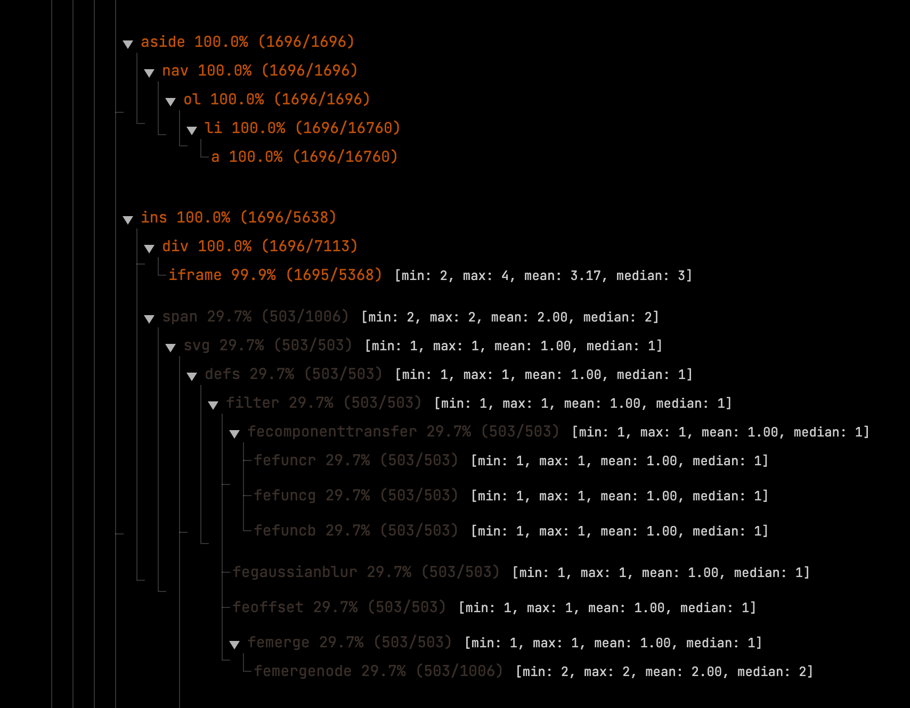

# Markup Heatmaps!

Markup Heatmaps are designed to visualize large html data scrape.


```python
import os
import sys
sys.path.append("./code")
```

## Part 1: Reading Tags


```python
from tag_reader import TagReader
```


```python
htmls_dir = "./data/htmls"
doms_dir = "./data/doms"
```


```python
for file in os.listdir(htmls_dir):
    if file.endswith(".html"):
        # check if the file is already processed
        if os.path.exists(os.path.join(doms_dir, file.replace(".html", ".json"))):
            continue

        reader = TagReader(os.path.join(htmls_dir, file))
        dom = reader.parse()
        reader.save_to_file(os.path.join(
            doms_dir, file.replace(".html", ".json")))
```

### Sample

```json
        {
          "body": [
            {
              "header": [
                {
                  "figure": [
                    {
                      "a": [
                        {
                          "img": []
                        }
                      ]
                    }
                  ]
                },
```


## Part 2: Aggregating `n` such DOMs


```python
from dom_aggregator import DomAggregator
```


```python
da = DomAggregator(doms_dir)
da.aggregate()
da.save_to_file("./assets/aggregated_dom.json")
```

### Sample

```json
          "body": {
            "stats": {
              "count": 1696,
              "total_occurrences": 1696,
              "percentage": 100.0
            },
            "children": {
              "header": {
                "stats": {
                  "count": 1696,
                  "total_occurrences": 1696,
                  "percentage": 100.0
                },
                "children": {
                  "figure": {
                    "stats": {
                      "count": 1696,
                      "total_occurrences": 1696,
                      "percentage": 100.0
                    },
                    "children": {
                      "a": {
                        "stats": {
                          "count": 1696,
                          "total_occurrences": 1696,
                          "percentage": 100.0
                        },
                        "children": {
                          "img": {
                            "stats": {
                              "count": 1696,
                              "total_occurrences": 1696,
                              "percentage": 100.0
                            },
                            "children": {}
                          }
                        }
                      }
                    }
                  },
```


## Part 3: Visualize it!




---

Under [its-ours](https://its-ours.org) license.

